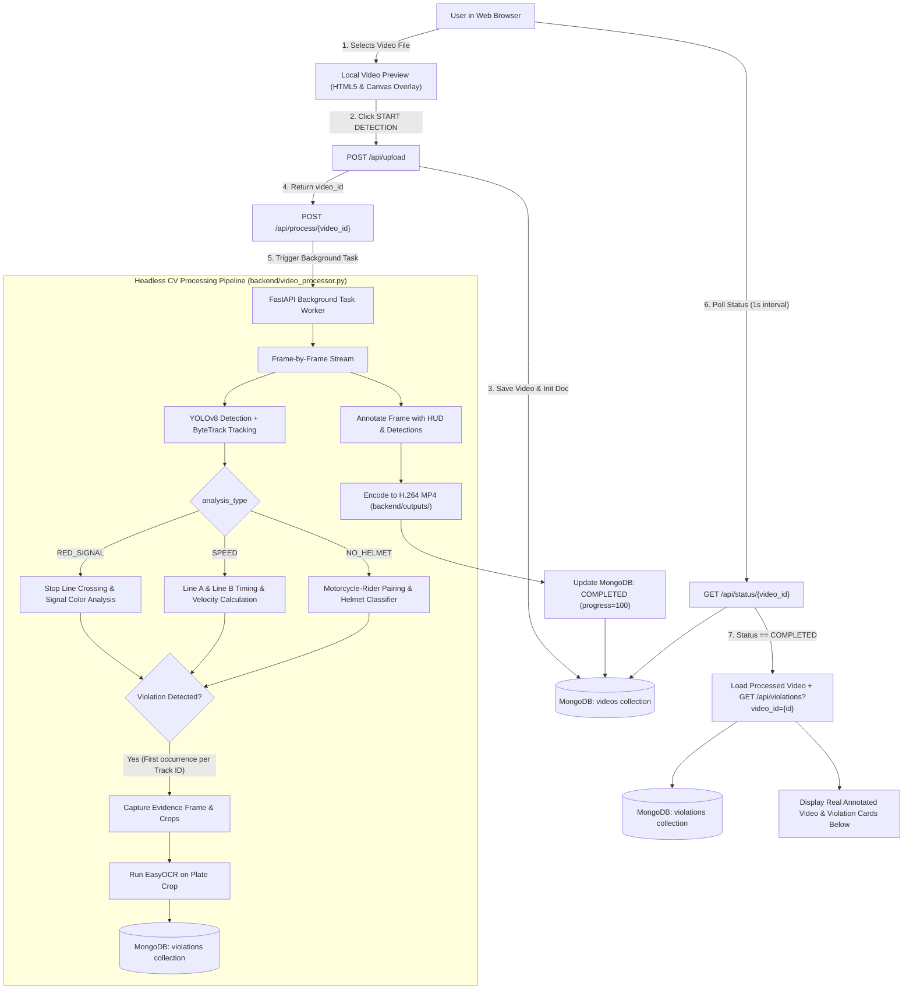

# PROJECT HANDOFF REPORT
**AI-Based Smart Traffic Violation Detection and Management System**  
*Comprehensive Engineering Handover Document for Next Antigravity Session*

---

> [!IMPORTANT]
> **TO THE INCOMING ANTIGRAVITY AGENT:**  
> This project is **fully functional, verified, and running**. Do **NOT** rebuild the codebase, do **NOT** reorganize directory structures, do **NOT** convert the frontend to React or another framework, and do **NOT** replace the working AI models. The current source code in this repository is the final authority. Read this report completely before executing any command or making any changes.

---

## 1. Project Identity & Purpose

- **Project Title:** AI-Based Smart Traffic Violation Detection and Management System
- **Core Purpose:** Automated analysis of traffic video footage to detect, track, record, and manage THREE specific traffic violations:
  1. **RED SIGNAL VIOLATION (`RED_LIGHT_JUMP`)**: Vehicles crossing a calibrated stop line while the traffic signal is RED.
  2. **SPEED VIOLATION (`SPEEDING`)**: Vehicles exceeding a calibrated road speed limit between two measurement lines.
  3. **NO HELMET VIOLATION (`NO_HELMET`)**: Motorcycle riders operating without protective headgear.
- **Key System Capabilities:**
  - Real-time vehicle detection and multi-object tracking using YOLOv8 and ByteTrack.
  - Headless video annotation generating browser-compatible H.264 MP4 videos.
  - Server-side evidence capture (full annotated frame, vehicle crop, license plate crop).
  - License plate OCR via EasyOCR with alphanumeric validation and `"Not Detected"` fallback (no synthetic plates).
  - Full persistence using MongoDB for video processing jobs and violation records.
  - Complete REST API implemented in FastAPI with CORS and static file serving.
  - Streamlined modern web frontend (no left sidebar) featuring a unified video workspace, real-time progress tracking, evidence display, interactive human review (APPROVE / REJECT), and persistent historical inspection.

---

## 2. Current Implementation Status

| Feature / Subsystem | Status | Implementation Details | Important Notes / Constraints |
|---|---|---|---|
| **Frontend UI** | **WORKING** | Plain HTML5, Tailwind CSS CDN, ES6 JavaScript modules in [`frontend/`](file:///d:/Smart-Traffic-Violation-Detection/frontend/) | Left sidebar removed; full-width modern responsive design |
| **FastAPI Backend** | **WORKING** | Headless REST API in [`backend/main.py`](file:///d:/Smart-Traffic-Violation-Detection/backend/main.py) on port 8000 | BackgroundTasks worker, CORS enabled, static mounts for `/outputs` & `/evidence` |
| **MongoDB Database** | **WORKING** | PyMongo integration in [`backend/database.py`](file:///d:/Smart-Traffic-Violation-Detection/backend/database.py) (`traffic_violation_db`) | Connection pooling, indexing on `video_id`, `status`, `created_at`, `violation_type` |
| **Video Upload** | **WORKING** | `POST /api/upload` accepting MP4, AVI, MOV, MKV | Generates UUID `video_id`, stores in `backend/uploads/` |
| **Video Preview** | **WORKING** | HTML5 `<video>` preview in unified workspace box | Generated via `URL.createObjectURL(file)`; local client preview before AI run |
| **Processing Progress** | **WORKING** | Real-time polling `GET /api/status/{video_id}` | Updates animated progress bar and percentage dynamically (0%–100%) |
| **Processed Video Generation** | **WORKING** | Headless OpenCV VideoWriter in [`backend/video_processor.py`](file:///d:/Smart-Traffic-Violation-Detection/backend/video_processor.py) | Prefers Windows Media Foundation H.264 (`CAP_MSMF`), falls back to `avc1`/`H264` |
| **YOLO Vehicle Detection** | **WORKING** | Ultralytics YOLOv8n (`backend/yolov8n.pt`) | Filters `car`, `bus`, `truck`, `motorcycle` at `conf=0.35`, `iou=0.45` |
| **ByteTrack Tracking** | **WORKING** | Ultralytics ByteTrack integration (`bytetrack.yaml`) | Maintains persistent Track IDs across frames with trajectory logging |
| **Red Signal Detection** | **WORKING** | Traffic light ROI color check + stop-line segment intersection | Violations trigger only when signal is RED and vehicle path intersects line |
| **Speed Detection** | **WORKING** | Two-line crossing timing ($v = \frac{d}{\Delta t} \times 3.6$) | Calibrated distance `10.0m`, speed limit `60.0 km/h`, validity filtering |
| **No Helmet Detection** | **WORKING** | Motorcycle-rider spatial pairing + head ROI classifier | 3-frame temporal confirmation, confidence threshold `0.40` |
| **Traffic Light Color Analysis** | **WORKING** | Classical CV in [`backend/detector.py`](file:///d:/Smart-Traffic-Violation-Detection/backend/detector.py) (CLAHE + dual HSV red ranges) | Analyzes cropped ROI; supports `"red"`, `"green"`, `"auto"` modes |
| **Stop-Line Crossing Math** | **WORKING** | CCW 2D line segment intersection in [`backend/utils.py`](file:///d:/Smart-Traffic-Violation-Detection/backend/utils.py) | Checks centroid trajectory vector $(C_{t-1} \to C_t)$ against stop line |
| **Speed Measurement Math** | **WORKING** | Time delta calculated via frame count and video FPS | Calibrated estimation; not radar-grade enforcement equipment |
| **Helmet Classification Model** | **WORKING** | YOLOv8n custom model (`backend/helmet_yolov8n.pt`) | Classes: `With Helmet`, `Without Helmet`; license/provenance not fully verified |
| **License Plate OCR** | **WORKING** | EasyOCR in [`backend/ocr_service.py`](file:///d:/Smart-Traffic-Violation-Detection/backend/ocr_service.py) | Alphanumeric normalization; gracefully falls back to `"Not Detected"` |
| **Evidence Screenshots** | **WORKING** | Saved directly to `backend/evidence/{video_id}/` by backend | Drawn line, bounding box, track ID, and bottom forensic banner |
| **Vehicle Crops** | **WORKING** | Bounding box crop extracted from violation frame | Saved as `vehicle_{violation_id}.jpg` and linked in MongoDB |
| **Plate Crops** | **WORKING** | Morphological plate localization in lower vehicle body | Saved as `plate_{violation_id}.jpg` if candidate plate is found |
| **Violation Cards** | **WORKING** | Dynamically rendered in [`frontend/main.js`](file:///d:/Smart-Traffic-Violation-Detection/frontend/main.js) | Filtered strictly to current video ID; displays photo, crops, OCR, reason |
| **Approve / Reject Review** | **WORKING** | `PATCH /api/violations/{id}/approve` & `/reject` | Updates MongoDB status, updates UI button states and tags |
| **History View** | **WORKING** | `GET /api/history` with tabbed filtering by analysis type | Renders all processed videos from MongoDB with timestamp and count |
| **View Analysis Flow** | **WORKING** | Seamless transition from History item to module workspace | Loads archived annotated video, historical violation cards, and review states |
| **Statistics API** | **WORKING** | `GET /api/statistics` aggregating MongoDB counts | Live counts for total videos, violations by type, pending, approved, rejected |
| **Stop Line / ROI Preview Overlay**| **WORKING** | Live canvas overlay in `RED_SIGNAL` module using `/api/config` | Scaled for `object-fit: contain` letterboxing; cleared when result video loads |
| **Interactive Calibration UI** | **NOT IMPLEMENTED** | N/A (Currently uses static `backend/road_config.json`) | Planned future enhancement for drawing custom lines per video |
| **Live CCTV / RTSP Streaming** | **NOT IMPLEMENTED** | N/A (System operates on uploaded file batches) | Video processing designed for headless file processing |
| **E-Challan / SMS / Email** | **NOT IMPLEMENTED** | N/A | No third-party notification or payment gateways connected |
| **User Authentication / RBAC** | **NOT IMPLEMENTED** | N/A | Open local development architecture |
| **Arbitrary Camera Generalization** | **KNOWN LIMITATION** | Coordinates in `road_config.json` tie to specific camera geometry | Videos with mismatched angles (e.g. `aziz2.MP4`) produce 0 violations |

---

## 3. Actual Project Structure & File Responsibilities

### Directory Tree
```
Smart-Traffic-Violation-Detection/
├── backend/
│   ├── config.py                 # Central backend configuration, paths, thresholds, HSV ranges
│   ├── database.py               # MongoDB connection pooling, indexing, CRUD, and aggregations
│   ├── detector.py               # Classical CV traffic light color detector (CLAHE, HSV masking)
│   ├── helmet_yolov8n.pt         # YOLOv8n fine-tuned weights for helmet detection (6.2 MB)
│   ├── main.py                   # FastAPI application, route handlers, background tasks, static mounts
│   ├── ocr_service.py            # EasyOCR license plate localization, normalization, and inference
│   ├── requirements.txt          # Python library dependencies
│   ├── road_config.json          # Calibrated coordinates (stop line, ROI, speed lines, thresholds)
│   ├── utils.py                  # Geometric intersection, HUD drawing, text rendering helpers
│   ├── video_processor.py        # Core CV engine: YOLO, ByteTrack, violations, evidence, H.264 writer
│   ├── yolov8n.pt                # Ultralytics pretrained COCO vehicle/person detection model (6.5 MB)
│   ├── uploads/                  # Storage directory for raw uploaded traffic videos
│   ├── outputs/                  # Storage directory for processed annotated H.264 MP4 videos
│   └── evidence/                 # Storage directory for violation snapshots and crops (by video_id)
├── frontend/
│   ├── data.js                   # API client helper functions connecting frontend to FastAPI backend
│   ├── detection.js              # Legacy overlay helper (historical Phase 0 compatibility)
│   ├── index.html                # Single-page web interface markup (Home, Module Workspace, History)
│   ├── main.js                   # Primary frontend controller: state, routing, upload, polling, review
│   ├── screenshot.js             # Legacy client-side screenshot helper (unused; server creates evidence)
│   ├── style.css                 # Custom styles, glow effects, glassmorphism, scrollbars, canvas overlay
│   ├── sample_helmet_traffic.mp4 # Verified sample for No-Helmet detection (64 frames, 720p)
│   ├── sample_red_light_traffic.mp4 # Verified sample for Red Signal detection (40 frames, 1080p)
│   └── sample_speed_traffic.mp4  # Verified sample for Speed violation detection (50 frames, 1080p)
├── FINAL_APPLICATION_REPORT.md   # Architectural documentation of three-module integration
├── PHASE0_REPORT.md              # Historical report: Elimination of client simulation & headless CV setup
├── PHASE1_REPORT.md              # Historical report: Red signal persistence, MongoDB, OCR, and review
├── PHASE2_REPORT.md              # Historical report: Speed violation detection pipeline
├── PHASE3_REPORT.md              # Historical report: No-helmet violation detection pipeline
├── RED_SIGNAL_VISUALIZATION_REPORT.md # Documentation of preview overlay and calibration geometry
├── UI_FLOW_FIX_REPORT.md         # Documentation of UI layout overhaul (sidebar removal)
├── VIOLATION_CAPTURE_FIX_REPORT.md # Documentation of end-to-end evidence capture debugging
├── README.md                     # Project overview and run instructions
└── .gitignore                    # Git tracking ignore rules
```

### Detailed File Responsibilities
- [`backend/main.py`](file:///d:/Smart-Traffic-Violation-Detection/backend/main.py): Fast HTTP gateway using FastAPI. Defines routes for `/api/health`, `/api/config`, `/api/upload`, `/api/process/{id}`, `/api/status/{id}`, `/api/result/{id}`, `/api/violations`, `/api/violations/{id}/approve`, `/api/violations/{id}/reject`, `/api/history`, and `/api/statistics`. Dispatches long-running CV processing to FastAPI `BackgroundTasks`.
- [`backend/video_processor.py`](file:///d:/Smart-Traffic-Violation-Detection/backend/video_processor.py): Heart of the detection pipeline. Iterates through video frames, executes YOLO tracking with ByteTrack, evaluates violation criteria, annotates video frames with HUD badges, captures evidence crops, executes OCR, writes violation documents to MongoDB, and compiles the browser-compatible H.264 output video.
- [`backend/config.py`](file:///d:/Smart-Traffic-Violation-Detection/backend/config.py): Configuration dictionary declaring directory paths, MongoDB connection string (`MONGO_URI`), database name (`traffic_violation_db`), model filenames, confidence thresholds (`CONF_VEHICLE = 0.35`, `CONF_HELMET = 0.35`), traffic light HSV color ranges, and allowed vehicle classes (`car`, `bus`, `truck`, `motorcycle`).
- [`backend/road_config.json`](file:///d:/Smart-Traffic-Violation-Detection/backend/road_config.json): Central camera calibration file defining the stop-line coordinates, traffic-light ROI rectangle, speed measurement lines (`line_a`, `line_b`), real-world distance in meters (`10.0`), speed limit (`60.0 km/h`), and helmet confirmation frame threshold (`3`).
- [`backend/detector.py`](file:///d:/Smart-Traffic-Violation-Detection/backend/detector.py): Classical computer vision module for traffic signal light classification. Applies CLAHE, Gaussian blur, dual red hue masks (`HSV_RED1` and `HSV_RED2`), morphological opening/closing, and pixel-intensity scoring to determine signal state (`red`, `yellow`, `green`, `unknown`).
- [`backend/ocr_service.py`](file:///d:/Smart-Traffic-Violation-Detection/backend/ocr_service.py): Automated license plate recognition service. Localizes candidate plate rectangles using morphological gradient / Blackhat transforms and aspect ratio filtering ($1.8 \le \text{AR} \le 5.5$). Runs cached EasyOCR, cleans text to alphanumeric `[A-Z0-9]`, validates structure, and outputs recognized text or `"Not Detected"`.
- [`backend/database.py`](file:///d:/Smart-Traffic-Violation-Detection/backend/database.py): PyMongo data-access layer. Manages persistent collections `videos` and `violations`, builds unique indexes, handles BSON/JSON serialization, and executes review status transitions (`APPROVED`, `REJECTED`).
- [`backend/utils.py`](file:///d:/Smart-Traffic-Violation-Detection/backend/utils.py): Mathematical and drawing utilities. Implements the 2D CCW (counter-clockwise) line segment intersection algorithm (`segments_intersect`) used for both stop line and speed line crossings.
- [`frontend/main.js`](file:///d:/Smart-Traffic-Violation-Detection/frontend/main.js): Single-page application controller. Manages view switching (`home`, `module`, `history`), module configuration, drag-and-drop file upload, local preview loading, live stop-line canvas overlay, asynchronous polling of processing status, rendering of video-specific violation cards, and review actions.
- [`frontend/data.js`](file:///d:/Smart-Traffic-Violation-Detection/frontend/data.js): Typed API wrapper providing `fetch` wrappers for all backend REST endpoints (`getHealth`, `getConfig`, `getViolations`, `approveViolation`, `rejectViolation`, `getHistory`).
- [`frontend/index.html`](file:///d:/Smart-Traffic-Violation-Detection/frontend/index.html): Semantic HTML structure containing top navigation, hero presentation, module selector cards, unified video workspace, progress indicator, violation cards section, and history tables.
- [`frontend/style.css`](file:///d:/Smart-Traffic-Violation-Detection/frontend/style.css): Custom stylesheet implementing Tailwind augmentations, neon accents, glow filters, glassmorphic panels, and overlay canvas styling (`pointer-events: none`).

---

## 4. System Architecture & Data Flow



---

## 5. Analysis Types & Pipeline Dispatch

The system natively supports THREE distinct analysis modes:
1. `RED_SIGNAL`
2. `SPEED`
3. `NO_HELMET`

### How `analysis_type` Travels Through the System:
1. **Frontend Initiation**: In [`frontend/main.js`](file:///d:/Smart-Traffic-Violation-Detection/frontend/main.js), `openModule(moduleType)` sets global state `currentAnalysisMode = "RED_SIGNAL" | "SPEED" | "NO_HELMET"`.
2. **Upload Request**: Sent as a multipart form field in `POST /api/upload` alongside the video file.
3. **MongoDB Video Record**: [`backend/main.py`](file:///d:/Smart-Traffic-Violation-Detection/backend/main.py) writes `analysis_type` directly into the `videos` document.
4. **Processing Pipeline**: `process_video()` reads `analysis_type` from the database record and activates only the corresponding violation detection logic and HUD annotations.
5. **MongoDB Violation Record**: Violations are tagged with the specific `violation_type`:
   - `RED_LIGHT_JUMP` (for Red Signal)
   - `SPEEDING` (for Speed Violation)
   - `NO_HELMET` (for Helmet Violation)
6. **History & Review**: History tabs in [`frontend/main.js`](file:///d:/Smart-Traffic-Violation-Detection/frontend/main.js) query `GET /api/history?analysis_type={mode}` to isolate records by category.

---

## 6. Detailed Module Specifications

### 6.1 RED SIGNAL Module (`RED_LIGHT_JUMP`)
- **Pipeline Logic**:
  1. Vehicles (`car`, `bus`, `truck`, `motorcycle`) are detected and tracked across frames by YOLOv8n + ByteTrack.
  2. For each tracked vehicle, its centroid path from previous frame $(C_{t-1})$ to current frame $(C_t)$ defines a motion vector.
  3. The motion vector is checked against the configured stop line $[P_1, P_2]$ using line segment intersection (`segments_intersect`).
  4. The traffic signal state is determined from the traffic light ROI (`TrafficLightDetector` in `detector.py` or configured static mode).
  5. **Exact Violation Condition**:
     $$\text{traffic\_signal} == \text{"RED"} \quad \land \quad \text{segments\_intersect}(C_{t-1}, C_t, P_1, P_2) == \text{True}$$
  6. **De-duplication**: Track IDs are recorded in `violated_ids`. Subsequent crossings or stationary dwell by the same vehicle do not produce duplicate violations.
  7. **Evidence Capture**: Full evidence frame annotated with a 4px red stop line, vehicle bounding box, violation label, and bottom forensic banner: `EVIDENCE | SIGNAL: RED | STOP LINE CROSSING | Track #{tid}`.
  8. **OCR & Database**: Vehicle crop and license plate crop are extracted, EasyOCR is executed, and a document with `violation_type: "RED_LIGHT_JUMP"` is committed to MongoDB.
- **Current Configured Coordinates**:
  - `stop_line`: `[[500, 500], [500, 900]]`
  - `traffic_light_roi`: `[[50, 50], [150, 200]]`
  - `traffic_light_mode`: `"red"`

### 6.2 SPEED Module (`SPEEDING`)
- **Pipeline Logic**:
  1. Vehicle centroids are tracked across two calibrated measurement lines: **Line A** (entry line) and **Line B** (exit line).
  2. When a tracked vehicle's centroid trajectory crosses Line A, its crossing frame index $f_A$ is stored in `line_a_crossings[tid]`.
  3. When the vehicle subsequently crosses Line B, its crossing frame index $f_B$ is stored in `line_b_crossings[tid]`.
  4. Time elapsed is calculated from frame delta and video FPS:
     $$\Delta t = \frac{|f_B - f_A|}{\text{FPS}}$$
  5. Vehicle speed is calculated using the configured physical distance:
     $$v = \left(\frac{\text{distance\_meters}}{\Delta t}\right) \times 3.6 \quad [\text{km/h}]$$
  6. **Validity Filtering**: Tracking noise is filtered out by requiring $0.04\text{s} \le \Delta t \le 30.0\text{s}$ and $1.0 \le v \le 250.0\text{ km/h}$.
  7. **Violation Condition**:
     $$v > \text{speed\_limit\_kmh} \quad (\text{Default: } 60.0\text{ km/h})$$
  8. **De-duplication**: Track IDs are recorded in `speed_violated_ids`. Exactly one violation document is generated per speeding vehicle.
  9. **Evidence & Database**: Frame annotated with Line A (cyan), Line B (orange), vehicle box, and speeding label. Committed to MongoDB with `violation_type: "SPEEDING"`.
- **Current Configured Parameters**:
  - `line_a`: `[[520, 450], [520, 950]]`
  - `line_b`: `[[730, 450], [730, 950]]`
  - `distance_meters`: `10.0`
  - `speed_limit_kmh`: `60.0`
- **Important Technical Note**: This is a computer-vision camera-calibrated speed estimation prototype. It does not replace certified radar or LiDAR hardware.

### 6.3 NO HELMET Module (`NO_HELMET`)
- **Pipeline Logic**:
  1. YOLOv8n simultaneously detects `motorcycle` and `person` instances.
  2. `associate_riders_with_motorcycles()` pairs detected persons with motorcycles based on horizontal centroid proximity ($(x_{\text{moto1}} - 0.35w) \le x_{\text{rider\_center}} \le (x_{\text{moto2}} + 0.35w)$) and vertical intersection ($>20\%$ overlap).
  3. For each associated rider, `classify_rider_helmet()` extracts the upper 65% head/torso crop and runs `backend/helmet_yolov8n.pt`.
  4. If classification detects `Without Helmet` with confidence $\ge 0.35$ (higher than `With Helmet`), the frame is marked as no-helmet.
  5. **Temporal Confirmation**: To eliminate single-frame false positives (e.g. occlusion or motion blur), the motorcycle tracker increments `no_helmet_frames`.
  6. **Violation Trigger**:
     $$\text{no\_helmet\_frames} \ge \text{confirmation\_frames} \quad (\ge 3\text{ frames})$$
  7. **De-duplication**: Motorcycle track ID is recorded in `helmet_violated_ids`.
  8. **Evidence & Database**: Captures full frame with motorcycle box (red), rider box (orange), and head crop box, plus vehicle crop and plate OCR. Committed to MongoDB with `violation_type: "NO_HELMET"`.
- **Current Configured Parameters**:
  - `helmet_confidence_threshold`: `0.40`
  - `confirmation_frames`: `3`

---

## 7. AI Models & Computer Vision Assets

| Model Asset | File Location | Framework | Source / Heritage | Classes / Output | Operational Parameters |
|---|---|---|---|---|---|
| **Vehicle & Person Detection** | [`backend/yolov8n.pt`](file:///d:/Smart-Traffic-Violation-Detection/backend/yolov8n.pt) (6.55 MB) | Ultralytics YOLOv8 | Pretrained COCO weights (Ultralytics) | 80 COCO classes (`person: 0`, `car: 2`, `motorcycle: 3`, `bus: 5`, `truck: 7`) | `conf=0.35`, `iou=0.45` |
| **Helmet Detection** | [`backend/helmet_yolov8n.pt`](file:///d:/Smart-Traffic-Violation-Detection/backend/helmet_yolov8n.pt) (6.20 MB) | Ultralytics YOLOv8 | Hugging Face: `iam-tsr/yolov8n-helmet-detection` | 2 classes: `0: With Helmet`, `1: Without Helmet` | *Note: Model license/provenance is not fully verified.* Evaluated at `conf=0.18` on head crops, thresholded at `0.35`–`0.40`. |
| **Object Tracking** | Embedded in Ultralytics | ByteTrack | Paper: *ByteTrack: Multi-Object Tracking by Associating Every Detection Box* | Persistent integer Track IDs across frames | Configured via `bytetrack.yaml` with `persist=True`. Requires Python package `lap`. |
| **Optical Character Recognition** | EasyOCR engine | PyTorch / CRAFT + CRNN | JaidedAI EasyOCR v1.7.2 | Alphanumeric English text recognition | Runs on CPU (`gpu=False`), enhanced by CLAHE preprocessing. Normalizes to `[A-Z0-9]`. |

---

## 8. Multi-Object Tracking (ByteTrack) Architecture

Tracking is critical because violations represent **temporal events**, not isolated static frames:
- **Red Signal Violation**: Requires proving a vehicle crossed a line *over time* ($C_{t-1} \to C_t$) rather than simply standing near it.
- **Speed Violation**: Requires tracking the exact same vehicle from Line A to Line B across multiple seconds.
- **Helmet Violation**: Requires accumulating temporal confirmation ($\ge 3$ consecutive frames) to eliminate transient occlusion false positives.

### Tracking Mechanics:
1. Called via `model.track(source=..., persist=True, tracker="bytetrack.yaml")`.
2. Bounding boxes are tracked across frames and assigned persistent integer Track IDs (`res.boxes.id`).
3. Centroids $C = \left(\frac{x_1 + x_2}{2}, \frac{y_1 + y_2}{2}\right)$ are logged into `prev_centers[tid]`.
4. **De-duplication Sets**:
   - `violated_ids = set()`: Global record of vehicles that jumped a red light.
   - `speed_violated_ids = set()`: Record of vehicles that committed a speed violation.
   - `helmet_violated_ids = set()`: Record of motorcycles confirmed without a helmet.
   Once a Track ID is added to a set, it can **never** generate a second violation document in the same video run.

---

## 9. Traffic Light Color Detection Algorithm

Implemented in [`backend/detector.py`](file:///d:/Smart-Traffic-Violation-Detection/backend/detector.py):
1. **Patch Preprocessing**: Traffic light ROI is cropped via `crop_roi()`. If patch dimensions exceed $160 \times 160$, it is downscaled.
2. **Smoothing**: Gaussian blur with a $5 \times 5$ kernel reduces sensor noise.
3. **Color Space Conversion**: Converted to HSV (`cv2.COLOR_BGR2HSV`).
4. **Contrast Normalization**: Contrast Limited Adaptive Histogram Equalization (CLAHE, `clipLimit=2.0`, `tileGridSize=(8, 8)`) is applied exclusively to the Value (V) channel.
5. **Dual-Hue Red Masking**: Red wraps around the $0^\circ / 180^\circ$ hue boundary:
   - `HSV_RED1`: Lower $[0, 80, 80]$, Upper $[10, 255, 255]$
   - `HSV_RED2`: Lower $[170, 80, 80]$, Upper $[180, 255, 255]$
   - Mask: $\text{red\_mask} = \text{red1} + \text{red2}$
6. **Yellow & Green Masks**:
   - `HSV_YELLOW`: Lower $[20, 90, 100]$, Upper $[32, 255, 255]$
   - `HSV_GREEN`: Lower $[40, 80, 80]$, Upper $[85, 255, 255]$
7. **Morphological Filtering**: Morphological Opening followed by Closing ($3 \times 3$ ellipse kernel) removes specular glare and dust artifacts.
8. **Intensity Scoring**: Pixel masks are weighted by the normalized Value channel:
   $$\text{Score}(c) = \sum \left(\frac{\text{Mask}_c}{255} \times \frac{V}{255}\right)$$
9. **Ambiguity Gate**:
   - Must exceed minimum pixel threshold: $\text{Score}_{\max} \ge 50$ and $\frac{\text{Score}_{\max}}{\text{TotalArea}} \ge 0.002$.
   - Must exceed second-place score by ratio $\ge 1.15$; otherwise returns `"unknown"`.

---

## 10. Road Configuration (`backend/road_config.json`)

The active camera calibration parameters stored in [`backend/road_config.json`](file:///d:/Smart-Traffic-Violation-Detection/backend/road_config.json):
```json
{
  "stop_line": [
    [500, 500],
    [500, 900]
  ],
  "traffic_light_roi": [
    [50, 50],
    [150, 200]
  ],
  "traffic_light_mode": "red",
  "speed": {
    "line_a": [
      [520, 450],
      [520, 950]
    ],
    "line_b": [
      [730, 450],
      [730, 950]
    ],
    "distance_meters": 10.0,
    "speed_limit_kmh": 60.0
  },
  "helmet": {
    "helmet_confidence_threshold": 0.40,
    "confirmation_frames": 3
  }
}
```

### Parameter Meanings:
- `stop_line`: Start $[X_1, Y_1]$ and end $[X_2, Y_2]$ coordinates of the red signal stop line in video pixel space.
- `traffic_light_roi`: Top-left $[X_1, Y_1]$ and bottom-right $[X_2, Y_2]$ coordinates of the traffic signal fixture.
- `traffic_light_mode`: `"red"` forces red signal state, `"green"` forces green, `"auto"` uses OpenCV color detector.
- `speed.line_a`: Start and end coordinates of entry speed measurement line.
- `speed.line_b`: Start and end coordinates of exit speed measurement line.
- `speed.distance_meters`: Physical calibrated distance between Line A and Line B in meters.
- `speed.speed_limit_kmh`: Posted road speed limit above which violations trigger.
- `helmet.helmet_confidence_threshold`: Minimum confidence required to accept a helmet state classification.
- `helmet.confirmation_frames`: Consecutive frames required before committing a `NO_HELMET` violation.

---

## 11. Important Camera Calibration Limitation

> [!WARNING]
> **CRITICAL ARCHITECTURAL REALITY:**  
> Stop-line coordinates and speed-line coordinates in `road_config.json` are **fixed geometric coordinates** tied to a specific camera perspective and resolution (1080p surveillance geometry).
>
> **The `aziz2.MP4` Observation**:
> During earlier testing, a test video named `aziz2.MP4` (118 frames, $4000 \times 3000$ resolution) was uploaded. The AI processed the video successfully to 100%, but produced **0 violations**. Why? Because in that video's coordinate space, vehicles travelled in a region of the frame that never intersected the fixed coordinates `[[500, 500], [500, 900]]`.
>
> **Takeaway for Developers & Testers**:
> An arbitrary uploaded traffic video may visibly show vehicles driving through an intersection, but if the camera angle or road position does not match the configured stop line or speed lines, **zero violations will be generated**. This is **expected geometric behavior**, NOT an evidence capture bug or backend failure.

---

## 12. License Plate OCR Pipeline

Implemented in [`backend/ocr_service.py`](file:///d:/Smart-Traffic-Violation-Detection/backend/ocr_service.py):
1. **Target Region**: Searches the lower 75% of the vehicle crop where license plates are mounted.
2. **Preprocessing**: Bilateral filtering ($d=9, \sigma_r=75, \sigma_s=75$) preserves edges while smoothing sheet metal noise. Morphological Blackhat ($13 \times 5$ rectangle) highlights plate characters against plate backgrounds.
3. **Contour Extraction**: Adaptive Canny edge detection followed by horizontal dilation. Contours are filtered by aspect ratio ($1.8 \le \text{AR} \le 5.5$) and relative area ($1.5\% \le \text{Area} \le 35\%$).
4. **Plausibility Scoring**: Prefers plates located in the lower vehicle half with standard aspect ratios ($\approx 3.5$).
5. **EasyOCR Inference**: CLAHE-enhanced candidate crops are passed to EasyOCR. Text is cleaned of punctuation and normalized to uppercase alphanumeric characters (`[A-Z0-9]`).
6. **Format Validation**: Validates whether text has both alphabets and numbers (e.g. standard Indian registration formats like `DL1CAB1234` or general 5–11 character plates).
7. **Strict Graceful Fallback**: If OCR cannot read characters with high confidence:
   $$\text{plate\_number} = \text{"Not Detected"}$$
   $$\text{ocr\_confidence} = \text{None}$$
   **Crucial Rule**: There are **no random plate generators** in the codebase. An OCR failure does **not** stop the violation record from being created. The violation is committed to MongoDB with plate number `"Not Detected"`.

---

## 13. Forensic Evidence Generation

When a violation triggers, the backend saves forensic evidence to disk in `backend/evidence/{video_id}/`:
1. **Full Evidence Frame (`evidence_{violation_id}.jpg`)**:
   - The original video frame at the exact moment of violation.
   - For `RED_SIGNAL`: 4px crimson stop line, red vehicle bounding box, violation label, and bottom forensic banner: `EVIDENCE | SIGNAL: RED | STOP LINE CROSSING | Track #{tid}`.
   - For `SPEED`: Line A (cyan), Line B (orange), vehicle bounding box, speed label showing detected speed and speed limit.
   - For `NO_HELMET`: Motorcycle bounding box (red), rider bounding box (orange), head bounding box.
2. **Vehicle Crop (`vehicle_{violation_id}.jpg`)**: High-resolution cutout of the violating vehicle.
3. **Plate Crop (`plate_{violation_id}.jpg`)**: Localized license plate cutout (if plate localization detected candidate).
4. **Static HTTP Mount**: Mounted by FastAPI at `/evidence/{video_id}/{filename}`, enabling browser display in violation cards.

---

## 14. Modern Frontend UI Design & User Flow

### UI Overhaul Completed
- **Left Sidebar Permanently Removed**: The interface uses the full browser width with modern responsive glassmorphism.
- **System Metrics Removed from Home**: The home page presents a focused, clean dashboard.
- **Top Navigation Bar**:
  - Brand identity: `SMART TRAFFIC`
  - Navigation buttons: `Home`, `History`
  - Live system status pill: `Online` (FastAPI backend connectivity indicator)
- **Home View (`#home-view`)**:
  - Hero header with system description.
  - Three primary module cards:
    - 🚦 **RED SIGNAL VIOLATION** (`openModule('RED_SIGNAL')`)
    - 🏎️ **SPEED VIOLATION** (`openModule('SPEED')`)
    - 🪖 **NO HELMET VIOLATION** (`openModule('NO_HELMET')`)

### Unified Module Workspace Flow (`#module-view`)
1. User clicks **Open Module**.
2. Video container is rendered inside a large central workspace card (`#video-workspace-box`).
3. User drags-and-drops or clicks **Choose Video File**, or clicks **Load Sample Video**.
4. Selected video appears **immediately inside the same container** as a local preview (`#video-preview-wrapper`), accompanied by file metadata and a "Change Video" button.
5. In `RED_SIGNAL` mode, the configured **Stop Line** and **Traffic Light ROI** are drawn directly over the preview via a transparent canvas overlay (`#video-overlay-canvas`), accompanied by an explanatory guide card below.
6. User clicks **START DETECTION**.
7. Button updates to processing state, and animated progress bar (`#processing-box`) shows live percentages (0% to 100%).
8. When processing completes, the **real AI-annotated H.264 video** replaces the preview in the exact same container. The preview overlay is automatically cleared to avoid double-drawing.
9. All real violation cards detected for this specific video are rendered below the player.

---

## 15. Violation Card Structure & Review Workflow

Each violation generates a forensic card containing:
- **Left Column**: High-resolution evidence screenshot thumbnail.
- **Center-Top Badges**:
  - Violation Type badge (e.g. `RED SIGNAL VIOLATION`, `SPEED VIOLATION`, `NO HELMET VIOLATION`)
  - Track ID badge (e.g. `Track #3`)
  - Timestamp & Frame badge (e.g. `Frame 18 • 00:00.7`)
- **Metric Highlights**:
  - For `RED_SIGNAL`: Signal state badge (`🔴 RED`)
  - For `SPEED`: Detected speed, speed limit, and excess speed (e.g. `83.1 km/h (Limit: 60 km/h) • Excess: +23.1 km/h`)
  - For `NO_HELMET`: Head classification status and confirmation frame count
- **Forensic Details**:
  - Reason statement
  - Vehicle classification (e.g. `truck`, `car`, `motorcycle`)
  - Detection confidence
  - License Plate Number (e.g. `DL1CAB1234` or `Not Detected`)
  - Vehicle crop thumbnail & plate crop thumbnail
- **Right Column (Human Review Actions)**:
  - Current review status badge (`PENDING`, `APPROVED`, `REJECTED`)
  - **Approve Button (`✓ Approve`)**: Triggers `PATCH /api/violations/{id}/approve`
  - **Reject Button (`✕ Reject`)**: Triggers `PATCH /api/violations/{id}/reject`

---

## 16. Persistent History & "View Analysis"

In the **History View (`#history-view`)**:
1. **Category Tabs**: Filter history by `RED_SIGNAL`, `SPEED`, or `NO_HELMET`.
2. **Archived Cards**: Every video ever processed is listed with filename, date/time, completion status, and violation count.
3. **View Analysis Action**: Clicking **View Analysis** on an archived video:
   - Switches to the Module Workspace for that violation type.
   - Loads the archived processed annotated video directly from `/outputs/processed_{video_id}.mp4`.
   - Fetches and displays all persistent violation cards from MongoDB for that video ID.
   - Retains previously approved/rejected review states.

---

## 17. MongoDB Schemas & Database Details

- **Database Name**: `traffic_violation_db`
- **Default URI**: `mongodb://localhost:27017` (configurable via `MONGO_URI` environment variable)

### Collections & Indexes
1. `videos` Collection:
   - `video_id` (Unique index, ascending)
   - `created_at` (Index, descending)
   - `status` (Index, ascending)
2. `violations` Collection:
   - `violation_id` (Unique index, ascending)
   - `video_id` (Index, ascending)
   - `status` (Index, ascending)
   - `violation_type` (Index, ascending)
   - `detected_at` (Index, descending)

### Document Schemas

#### `videos` Schema
```json
{
  "_id": "67a123...",
  "video_id": "70630f5f-d4d1-493a-9a44-b05d9847118f",
  "original_filename": "sample_red_light_traffic.mp4",
  "stored_filename": "70630f5f-d4d1-493a-9a44-b05d9847118f.mp4",
  "input_path": "backend/uploads/70630f5f-d4d1-493a-9a44-b05d9847118f.mp4",
  "analysis_type": "RED_SIGNAL",
  "output_path": "backend/outputs/processed_70630f5f-d4d1-493a-9a44-b05d9847118f.mp4",
  "status": "COMPLETED",
  "progress": 100,
  "total_frames": 40,
  "violations_count": 2,
  "created_at": "2026-10-05T11:13:35.123456Z",
  "started_at": "2026-10-05T11:13:36.123456Z",
  "completed_at": "2026-10-05T11:13:42.123456Z",
  "error": null
}
```

#### `violations` Schema (Red Signal Example)
```json
{
  "_id": "67a456...",
  "violation_id": "9891894c-e45b-456d-ab54-5d4b2f96a3ee",
  "video_id": "70630f5f-d4d1-493a-9a44-b05d9847118f",
  "track_id": 3,
  "violation_type": "RED_LIGHT_JUMP",
  "vehicle_class": "truck",
  "detection_confidence": 0.88,
  "frame_number": 18,
  "video_timestamp_seconds": 0.72,
  "detected_at": "2026-10-05T11:13:40.123456Z",
  "traffic_light_state": "red",
  "reason": "Vehicle crossed the configured stop line while the traffic signal was RED.",
  "plate_number": "Not Detected",
  "ocr_confidence": null,
  "bounding_box": [510, 480, 890, 780],
  "evidence_image": "/evidence/70630f5f-d4d1-493a-9a44-b05d9847118f/evidence_9891894c-e45b-456d-ab54-5d4b2f96a3ee.jpg",
  "vehicle_crop": "/evidence/70630f5f-d4d1-493a-9a44-b05d9847118f/vehicle_9891894c-e45b-456d-ab54-5d4b2f96a3ee.jpg",
  "plate_crop": null,
  "status": "PENDING",
  "reviewed_at": null
}
```

#### `violations` Schema (Speed Example)
Includes additional fields:
- `detected_speed_kmh`: `83.1`
- `speed_limit_kmh`: `60.0`
- `speed_excess_kmh`: `23.1`

#### `violations` Schema (No Helmet Example)
Includes additional fields:
- `rider_box`: `[x1, y1, x2, y2]`
- `head_box`: `[x1, y1, x2, y2]`
- `helmet_status`: `"NO_HELMET"`
- `helmet_confidence`: `0.71`

---

## 18. Complete REST API Reference

| Method | Endpoint | Purpose | Inputs | Key Response Fields |
|---|---|---|---|---|
| `GET` | `/api/health` | Verifies API and MongoDB connectivity | None | `{"status": "ok", "database_connected": true}` |
| `GET` | `/api/config` | Returns active camera calibration & road config | None | `{"stop_line": [...], "traffic_light_roi": [...], "speed": {...}, "helmet": {...}}` |
| `POST` | `/api/upload` | Uploads raw video and creates MongoDB job | Multipart: `file` (binary), `analysis_type` (str) | `{"video_id": "uuid", "filename": "...", "analysis_type": "...", "status": "UPLOADED"}` |
| `POST` | `/api/process/{video_id}` | Triggers asynchronous background CV processing | Path: `video_id` | `{"video_id": "...", "status": "PROCESSING", "message": "..."}` |
| `GET` | `/api/status/{video_id}` | Polls real-time processing progress and status | Path: `video_id` | `{"video_id": "...", "status": "PROCESSING\|COMPLETED\|FAILED", "progress": int, "violations": int, "error": str}` |
| `GET` | `/api/result/{video_id}` | Retrieves final processed H.264 video URL | Path: `video_id` | `{"video_id": "...", "video_url": "/outputs/processed_{id}.mp4", "violations": int, "total_frames": int}` |
| `GET` | `/api/violations` | Queries persistent violation records | Query: `video_id`, `status`, `violation_type` | List of violation JSON objects |
| `GET` | `/api/violations/{violation_id}` | Retrieves single violation record | Path: `violation_id` | Single violation JSON object |
| `PATCH`| `/api/violations/{violation_id}/approve` | Marks violation as APPROVED with timestamp | Path: `violation_id` | Updated violation JSON object (`status: "APPROVED"`) |
| `PATCH`| `/api/violations/{violation_id}/reject` | Marks violation as REJECTED with timestamp | Path: `violation_id` | Updated violation JSON object (`status: "REJECTED"`) |
| `GET` | `/api/history` | Retrieves list of processed videos | Query: `analysis_type` (optional) | List of formatted video tracking objects |
| `GET` | `/api/statistics` | Returns database aggregate metrics | None | `{"total_videos": int, "total_violations": int, "red_light_violations": int, ...}` |

---

## 19. Verified Sample Videos & Expected Results

Three verified test videos are included directly in the repository (both in `frontend/` and project root):

1. **`sample_red_light_traffic.mp4`**
   - **Properties**: 40 frames, $1920 \times 1080$, 25 FPS, 1.98 MB.
   - **Analysis Mode**: `RED_SIGNAL`
   - **Verified Results**: **2 Violations** detected:
     - Truck Track #3 (Frame 18, Stop Line Crossing)
     - Car Track #1 (Frame 24, Stop Line Crossing)
2. **`sample_speed_traffic.mp4`**
   - **Properties**: 50 frames, $1920 \times 1080$, 25 FPS, 2.48 MB.
   - **Analysis Mode**: `SPEED`
   - **Verified Results**: **2 Violations** detected:
     - Bus Track #3 ($\approx 83.1\text{ km/h}$, Speed Limit: $60.0\text{ km/h}$)
     - Car Track #1 ($\approx 83.1\text{ km/h}$, Speed Limit: $60.0\text{ km/h}$)
3. **`sample_helmet_traffic.mp4`**
   - **Properties**: 64 frames, $1280 \times 720$, 25 FPS, 6.92 MB.
   - **Analysis Mode**: `NO_HELMET`
   - **Verified Results**: **1 Violation** detected:
     - Motorcycle Track #12 ($\ge 3$ confirmed frames without helmet, confidence $\approx 0.71$)

---

## 20. Comprehensive Bug Fix Registry (Do Not Reintroduce)

The following bugs were encountered and definitively fixed during earlier development phases. **Do not reintroduce them:**
1. **Fake Frontend Violation Timers**: Removed synthetic `setTimeout()` triggers in JavaScript that generated fake violation cards.
2. **Hardcoded Frontend Bounding Boxes**: Removed fake client-drawn boxes from `index.html`.
3. **Random Indian License Plate Generator**: Removed synthetic plate string generators. When EasyOCR fails, plates cleanly fall back to `"Not Detected"`.
4. **Synthetic Processing Delays**: Removed artificial `sleep()` and timer increments. Progress bars now poll real MongoDB progress.
5. **Headless `cv2.imshow` Crashing**: Removed all interactive GUI calls (`cv2.imshow`, `cv2.waitKey`) from backend code to support headless server execution.
6. **In-Memory Job Tracking**: Replaced volatile Python dictionary storage with persistent MongoDB collections (`videos`, `violations`).
7. **Windows Media Foundation MP4 Incompatibility**: Configured OpenCV VideoWriter with `cv2.CAP_MSMF` and `H264` codec so generated MP4 videos play natively in modern web browsers without black screens or codec errors.
8. **Disconnected Layout**: Consolidated the file upload drop-zone and video player into the exact same container, eliminating awkward jumping between separate cards.
9. **Global Violation Card Bleed**: Fixed `loadViolationsForVideo()` to query `GET /api/violations?video_id={id}`, ensuring cards displayed below a video belong exclusively to that specific video.
10. **Evidence URL Static Routing**: Mounted `backend/evidence/` via FastAPI StaticFiles so snapshots and crops render reliably in browser `` tags.
11. **Permanent Left Sidebar Clutter**: Removed the legacy left navigation panel in favor of a clean, full-width interface.
12. **Home Screen Clutter**: Removed unneeded System Metrics cards from the home screen.

---

## 21. Environment & Dependencies

- **Runtime**: Python 3.12.10 (64-bit on Windows)
- **Primary Libraries** (`backend/requirements.txt`):
  ```
  fastapi==0.142.2
  uvicorn==0.54.0
  python-multipart
  ultralytics==8.4.166
  opencv-python==5.0.0.93
  pymongo==4.18.2
  easyocr==1.7.2
  ```
- **Tracking Prerequisite**: `lap==0.5.13` (Linear Assignment Problem solver required by ByteTrack).
- **Database**: MongoDB Community Server running locally on port 27017.

### Installation Command
```powershell
py -m pip install -r backend/requirements.txt
py -m pip install lap
```

---

## 22. How to Run the Application

### 1. Ensure MongoDB is Running
Make sure the MongoDB service is active on port 27017:
```powershell
mongod --dbpath <your_db_path>
# Or ensure the Windows MongoDB service is running
```

### 2. Start the FastAPI Backend
From the project root (`Smart-Traffic-Violation-Detection`):
```powershell
py -m uvicorn main:app --app-dir backend --host 127.0.0.1 --port 8000
```
- API Base: `http://127.0.0.1:8000`
- Interactive API Docs (Swagger): `http://127.0.0.1:8000/docs`

### 3. Start the Frontend Server
From the project root (`Smart-Traffic-Violation-Detection`):
```powershell
py -m http.server 5500 --directory frontend
```
- Web Application URL: `http://127.0.0.1:5500/index.html`

---

## 23. Developer Startup Checklist

When starting a new development session, follow this verification checklist:
1. [ ] Check MongoDB status: verify `mongodb://localhost:27017` is reachable.
2. [ ] Launch backend uvicorn server on port 8000.
3. [ ] Verify backend health: `GET http://127.0.0.1:8000/api/health` should return `{"status": "ok", "database_connected": true}`.
4. [ ] Launch frontend static server on port 5500.
5. [ ] Open `http://127.0.0.1:5500/index.html` in browser.
6. [ ] Confirm top navigation shows green `Online` indicator.
7. [ ] Run one verified sample video (`sample_red_light_traffic.mp4`) to confirm end-to-end functionality before touching any code.

---

## 24. Test / Development Data Notice

> [!NOTE]
> MongoDB (`traffic_violation_db`) currently contains historical development records ($\approx 29$ video records and $\approx 44$ violation records). **DO NOT delete or wipe this database**, as it validates historical browsing, review workflows, and statistics.

---

## 25. Non-Regression Requirements: DO NOT BREAK THESE WORKING FEATURES

Any future modifications **must preserve the following working features**:
- [x] YOLOv8 vehicle detection & ByteTrack tracking
- [x] Red signal detection & stop-line crossing calculation
- [x] Speed violation calculation & two-line timing
- [x] No-helmet detection & temporal confirmation
- [x] Classical CV traffic light detector (CLAHE & dual HSV red ranges)
- [x] EasyOCR plate recognition with `"Not Detected"` fallback
- [x] Server-side evidence capture (full frame, vehicle crop, plate crop)
- [x] Headless browser-compatible H.264 MP4 generation
- [x] MongoDB video and violation document persistence
- [x] Video-specific violation filtering on the frontend
- [x] Human Approve / Reject review actions
- [x] History view with category tabs and "View Analysis"

---

## 26. Current Unimplemented Features (Future Scope)

The following capabilities are **not currently implemented** in the repository:
- **Interactive In-Browser Calibration**: Drawing stop lines and speed lines directly on video canvas by dragging points (currently uses static `road_config.json`).
- **Live RTSP / CCTV Streaming**: Real-time camera stream ingestion via WebSocket or WebRTC (system currently processes uploaded video files).
- **Automated Camera Calibration**: Automatic vanishing-point estimation or road plane homography.
- **E-Challan / Automated Fines**: PDF fine ticket generation, payment gateway integration, or government registry lookup.
- **SMS / Email Alerts**: Automated notification delivery to vehicle owners.
- **Authentication & RBAC**: User accounts, login/password, role-based access control (Admin, Traffic Officer, Auditor).
- **Cloud / Edge Deployment**: Dockerization, Kubernetes manifests, or edge optimization (TensorRT / ONNX).

---

## 27. NEXT DEVELOPMENT TASK

> [!IMPORTANT]
> ### RED SIGNAL DETECTION ZONE VISUALIZATION
> **DO NOT IMPLEMENT THIS FEATURE DURING HANDOFF REPORT GENERATION.**  
> This is documented here so the next developer understands the exact requirements before beginning.

### Objective
Provide clear visual feedback of the camera calibration when an operator selects a video in the `RED_SIGNAL` module, so the operator understands *where* violations are tracked before clicking "Start Detection".

### Detailed Requirements for Next Developer:
1. **Instant Preview Display**: When the user selects or uploads a `RED_SIGNAL` video, it must immediately appear in the video player workspace.
2. **Overlay Configured Calibration**:
   - The configured **Stop Line** must be visibly rendered over the preview video.
   - The configured **Traffic Light ROI** must be visibly marked over the preview video.
3. **Interactive & Playable**: The user must be able to play, scrub, pause, and fullscreen the preview video with the overlay remaining aligned. The overlay canvas must use `pointer-events: none` so video controls are 100% responsive.
4. **Single Source of Truth**: The overlay must dynamically fetch coordinates from the backend (`GET /api/config` / `road_config.json`). Do **not** hardcode coordinates into JavaScript.
5. **Accurate Resolution & Aspect-Ratio Scaling**:
   - The overlay math must transform original video pixel coordinates ($W_{\text{vid}} \times H_{\text{vid}}$) to client canvas coordinates ($W_{\text{elem}} \times H_{\text{elem}}$).
   - The math must account for `object-fit: contain` letterboxing (black bars top/bottom) or pillarboxing (black bars left/right).
6. **Overlay is Visualization ONLY**: All violation decisions remain strictly backend-driven. The frontend does not make detection decisions.
7. **Clean Result Video Transition**: When the backend finishes processing and returns the annotated video, the preview canvas overlay must be cleared to prevent double-drawing over burned-in annotations.
8. **Processed Video Annotations**:
   - Stop line and traffic light ROI.
   - Real-time `SIGNAL: RED` / `SIGNAL: GREEN` HUD badge.
   - Vehicle bounding boxes with Track IDs.
   - Distinct labeling for violating vehicles (`VIOLATION: RED LIGHT JUMP | Track #{tid}`).
   - Evidence screenshots featuring the stop line, vehicle box, and bottom forensic banner.

---

## 28. Important Note About Next Feature

- **Calibration Visualization vs. Automatic Guessing**: The visualization must represent the **currently configured calibration** from `backend/road_config.json`. It must **not** attempt to guess lines automatically for arbitrary videos.
- **Future Scope (Interactive Calibration)**: In a future phase, this can be expanded into an interactive tool where the user drags handles to calibrate lines per camera. For now, keep it strictly to visualizing the active configuration.

---

## 29. Recommended Development Order

1. **Step 1 (Next)**: Finalize and verify the **Red Signal stop-line + traffic-light ROI preview visualization**.
2. **Step 2**: Implement **Interactive per-video calibration** (allowing operators to adjust coordinates via canvas dragging).
3. **Step 3 (Secondary)**: Integrate specialized Indian license plate detection models (e.g. YOLOv8 plate detector before EasyOCR).
4. **Step 4 (Enterprise)**: Implement E-Challan generation, SMS/Email alerts, and user authentication.

---

## 30. INSTRUCTIONS FOR THE NEXT ANTIGRAVITY AGENT

You are continuing an **EXISTING WORKING PROJECT**.

- **DO NOT rebuild this application.**
- **DO NOT replace the frontend framework** (do not convert to React, Vue, Angular, or Next.js).
- **DO NOT reorganize the project** without explicit user approval.
- **DO NOT replace the working AI models** (`yolov8n.pt`, `helmet_yolov8n.pt`).
- **DO NOT create fake violation records** or client-side simulations.
- **DO NOT create random plate numbers.**
- **DO NOT use frontend simulation for detections.**

Read [`PROJECT_HANDOFF_REPORT.md`](file:///d:/Smart-Traffic-Violation-Detection/PROJECT_HANDOFF_REPORT.md) completely.

Then inspect current source code:
- Current source code is the **final authority**.

Before modifying anything:
1. Run MongoDB.
2. Start FastAPI (`py -m uvicorn main:app --app-dir backend --host 127.0.0.1 --port 8000`).
3. Check `GET http://127.0.0.1:8000/api/health`.
4. Start frontend (`py -m http.server 5500 --directory frontend`).
5. Run one known sample through each module (`sample_red_light_traffic.mp4`, `sample_speed_traffic.mp4`, `sample_helmet_traffic.mp4`).
6. Confirm `RED_SIGNAL`, `SPEED`, and `NO_HELMET` still work.

The next requested development task is:
**RED SIGNAL DETECTION ZONE VISUALIZATION.**

**Do not begin it until the user explicitly asks you to continue.**
